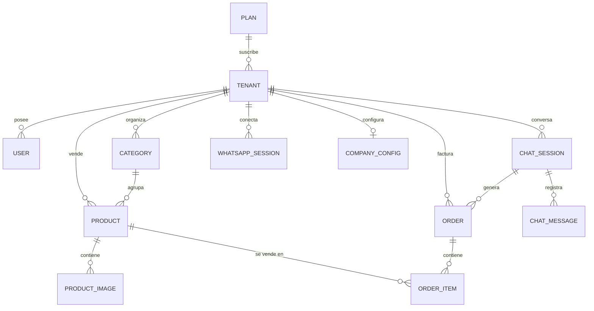

# Modelo de Datos y Base de Datos (PostgreSQL 16 / Prisma)

## 1. Visión General del Modelo Relacional

La persistencia de **WSP Flow** está implementada sobre **PostgreSQL 16** gestionada a través de **Prisma ORM**. Todas las tablas operacionales están aisladas por la clave foránea `tenantId` para soportar la arquitectura multi-inquilino (Multi-Tenant SaaS).

---

## 2. Enums Principales

| Enum | Valores | Propósito |
| :--- | :--- | :--- |
| `Role` | `SUPER_ADMIN`, `ADMIN`, `SUBADMIN` | Control de accesos y permisos jerárquicos. |
| `TenantPlan` | `FREE_TRIAL`, `BASIC`, `PRO`, `ENTERPRISE` | Niveles de suscripción y límites de recursos. |
| `TenantStatus` | `ACTIVE`, `SUSPENDED`, `PENDING_PAYMENT` | Estado operacional de la tienda SaaS. |
| `OrderStatus` | `PENDING`, `CONFIRMED`, `PROCESSING`, `SHIPPED`, `DELIVERED`, `CANCELLED` | Pipeline del tablero Kanban de pedidos. |
| `PaymentMethod` | `MERCADOPAGO`, `CULQI_CARD`, `CULQI_YAPE`, `CASH_ON_DELIVERY`, `BANK_TRANSFER`, `PENDING` | Modalidad de liquidación del pago. |
| `PaymentStatus` | `PENDING`, `AWAITING_CASH`, `PAID`, `REFUNDED`, `FAILED` | Estado transaccional en pasarela de pagos. |
| `SessionStatus` | `DISCONNECTED`, `SCAN_QR`, `CONNECTING`, `CONNECTED` | Estado del socket Baileys con WhatsApp. |
| `MessageSender` | `CUSTOMER`, `BOT`, `AGENT` | Emisor en el historial de chat en vivo. |

---

## 3. Diagrama de Relaciones de Datos (ERD)

---

## 4. Modelos Principales

### 4.0. `Plan` (Planes de Suscripción SaaS)
- Clave primaria `id` (UUID).
- `code`: Código único referencial (`TenantPlan` enum: `FREE_TRIAL`, `BASIC`, `PRO`, `ENTERPRISE`).
- `name`: Nombre legible del plan.
- `price`, `currency`: Precio y moneda (`PEN`).
- `maxProducts`, `maxBroadcasts`, `maxUsers`: Cuotas de consumo (-1 = ilimitado).
- `hasMercadoPago`, `hasAiBot`, `hasCustomThemes`, `hasPdfCatalog`: Banderas de activación de módulos.
- `features`: Array de bullets descriptivos.
- `isPopular`, `isActive`: Parámetros de presentación comercial.

### 4.1. `Tenant` (Inquilino SaaS)
- Clave primaria `id` (UUID).
- `name`: Nombre comercial de la empresa.
- `slug`: Identificador URL en minúsculas (ej: `wsp-tech`).
- `plan`: Código del plan suscrito (`planRef` hacia `Plan.code`).
- `status`: Estado del servicio (`ACTIVE` / `SUSPENDED`).
- `maxProducts`, `maxBroadcasts`: Cuotas sincronizadas desde el plan activo.
- `mpPublicKey`, `mpAccessToken`, `mpRefreshToken`, `mpUserId`, `mpConnectedAt`: Credenciales y tokens OAuth Connect de Mercado Pago.
- `culqiPublicKey`: Clave pública de Culqi (fallback retrocompatible).

### 4.2. `User` (Autenticación y RBAC)
- Clave foránea `tenantId` (opcional si es `SUPER_ADMIN`).
- `email`: Correo único de inicio de sesión.
- `passwordHash`: Encriptación mediante Bcrypt (12 rondas).
- `role`: `SUPER_ADMIN`, `ADMIN` o `SUBADMIN`.
- `isActive`: Flag booleano para habilitar/bloquear accesos.

### 4.3. `Product` y `ProductImage`
- `name`, `slug`, `sku` (único por tenant).
- `price`: Precio de venta (`Decimal(10,2)`).
- `stock`: Inventario numérico con descuento concurrente.
- `isAvailable`: Disponibilidad en catálogo de WhatsApp y tienda web.
- `images`: Soporte hasta 3 imágenes de alta resolución.
- `videoUrl`: Video demostrativo de hasta 10MB.

### 4.4. `Order` y `OrderItem`
- `orderNumber`: Código secuencial único (ej: `ORD-2026-0001`).
- `status`: Estado del flujo To-Do / Kanban.
- `subtotal`, `deliveryFee`, `total`: Valores monetarios calculados.
- `paymentMethod`, `paymentStatus`: Información de Mercado Pago, Culqi o pago contra entrega.
- `deliveryType`: `PICKUP`, `HOME_DELIVERY`, `PROVINCE_AGENCY`.
- `mercadoPagoPaymentId`, `mercadoPagoPreferenceId`: Identificadores devueltos por la API de Mercado Pago.
- `chargeId`: Identificador devuelto por la API de Culqi (retrocompatible).

### 4.5. `CompanyConfig`
- Información corporativa, dirección física, horarios y políticas de despacho.
- Contexto del bot: `systemPrompt`, `aiModel`, `aiTemperature`.
- `antiBanDelayMinMs`, `antiBanDelayMaxMs`: Parámetros de simulación humana.
- `storeTheme`: Configuración serializada en JSON con estilos visuales, fuentes y banners de la tienda pública.
