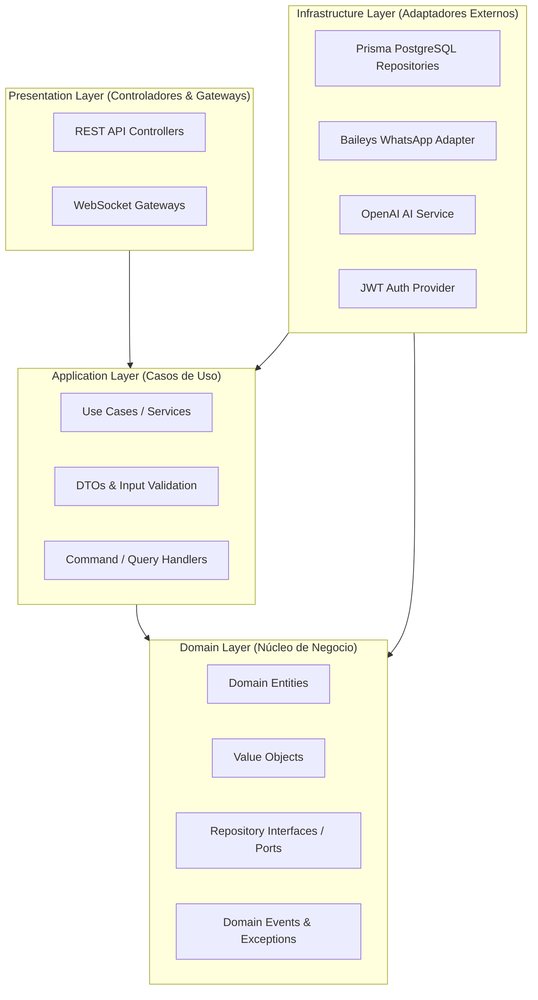

# Arquitectura del Sistema y Principios de Diseño

## 1. Visión General de la Arquitectura

El backend de **WSP Flow** se estructura bajo los principios de **Clean Architecture (Arquitectura Limpia / Hexagonal)** dividida en capas concéntricas, desacoplando estrictamente la lógica del negocio de los detalles de infraestructura, frameworks y librerías externas.



---

## 2. Capas del Backend (NestJS)

1. **Domain Layer (`src/domain`):**
   - El núcleo del sistema. No contiene dependencias de NestJS ni de Prisma.
   - Define las entidades de negocio (`ProductEntity`, `OrderEntity`, `UserEntity`, `TenantEntity`).
   - Define las interfaces de puertos (`IProductRepository`, `IOrderRepository`, `ICompanyConfigRepository`).
   - Define excepciones de dominio (`InsufficientStockException`, `TenantNotFoundException`).

2. **Application Layer (`src/application`):**
   - Orquesta los casos de uso del negocio.
   - Contiene los servicios de aplicación (`OrdersService`, `ProductsService`, `BroadcastService`, `TenantsService`).
   - Define DTOs de entrada y salida con validaciones mediante `class-validator`.

3. **Infrastructure Layer (`src/infrastructure`):**
   - Implementa los puertos definidos en el dominio.
   - Persistencia: `PrismaService`, repositorios Prisma (`PrismaProductRepository`, `PrismaCompanyConfigRepository`).
   - Adaptador WhatsApp: `@whiskeysockets/baileys` con persistencia de auth multi-archivo.
   - Inteligencia Artificial: `AiService` con OpenAI (`gpt-4o-mini` / `gpt-5.6-luna`) y Function Calling.
   - Generación de Documentos: `CatalogPdfService` utilizando PDFKit.

4. **Presentation Layer (`src/presentation`):**
   - Expone la API REST mediante controladores HTTP (`ProductsController`, `OrdersController`, `TenantsController`).
   - Gateways WebSockets (`WhatsAppSocketGateway`, `ChatSocketGateway`) para eventos en tiempo real hacia Angular.

---

## 3. Principios SOLID Aplicados

1. **S - Single Responsibility Principle (Responsabilidad Única):**
   - Cada servicio tiene un propósito delimitado. `OrdersService` gestiona el ciclo de vida de las ventas y el stock; la comunicación hacia WhatsApp se delega a `WhatsAppNotificationService`, y los pagos a `PaymentsService`.
2. **O - Open/Closed Principle (Abierto/Cerrado):**
   - Los flujos de mensajes y comandos del bot de WhatsApp están estructurados con estrategias desacopladas, permitiendo añadir nuevas herramientas de Function Calling sin modificar el despachador central.
3. **L - Liskov Substitution Principle (Sustitución de Liskov):**
   - Las implementaciones de repositorios pueden ser reemplazadas por mocks o por diferentes motores de base de datos sin alterar la capa de aplicación.
4. **I - Interface Segregation Principle (Segregación de Interfaces):**
   - Interfaces específicas por dominio en lugar de repositorios sobrecargados.
5. **D - Dependency Inversion Principle (Inversión de Dependencias):**
   - La lógica de negocio depende de abstracciones e interfaces, inyectadas automáticamente por el contenedor IoC de NestJS.

---

## 4. Estructura de Directorios del Monorepo

```text
wsp-v4/
├── backend/                             # API NestJS (Clean Architecture)
│   ├── src/
│   │   ├── core/                        # Guards, Decorators, Interceptors, Filters
│   │   ├── domain/                      # Entidades, Value Objects, Puertos (Interfaces)
│   │   ├── application/                 # Servicios de aplicación y DTOs
│   │   ├── infrastructure/              # Prisma, Baileys, OpenAI, PDFKit, Multer
│   │   └── presentation/                # Controladores REST y Gateways WebSocket
│   └── prisma/                          # schema.prisma, migraciones y seeders
├── frontend/                            # Aplicación Angular 18+ (Standalone + Tailwind)
│   ├── src/app/
│   │   ├── core/                        # Servicios singleton, auth, guards, interceptores, ToastService
│   │   ├── shared/                      # Componentes Bento, ToastContainer, CartDrawer
│   │   └── features/                    # Módulos: store, dashboard, orders, products, live-chat, admin
└── docs/                                # Documentación técnica modularizada
```
