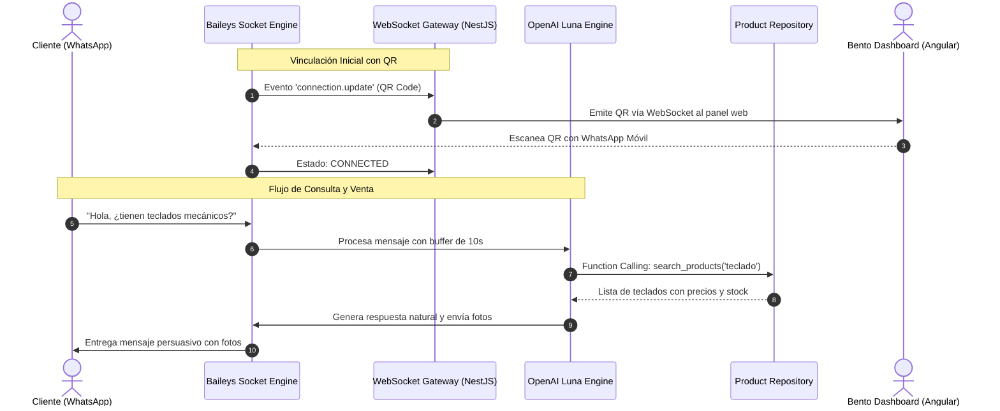

# Motor de WhatsApp Bot (@whiskeysockets/baileys) & Asistente IA Luna

## 1. Arquitectura del Motor Baileys

La comunicación con WhatsApp se gestiona mediante la librería `@whiskeysockets/baileys` en `BaileysWhatsAppService`, conectándose directamente a los servidores WebSockets de WhatsApp Web multi-dispositivo sin intermediarios ni costos por mensaje.

---

## 2. Persistencia y Ciclo de Vida de la Conexión

- **Multi-File Auth State (`useMultiFileAuthState`):** Las credenciales y claves de cifrado de WhatsApp se guardan en el sistema de archivos bajo `./auth_info_baileys/:tenantId`.
- **Reconexión Automática Inteligente:** Si ocurre una desconexión por fluctuaciones de red o reinicio del servidor, el servicio evalúa el código de error:
  - Si es `DisconnectReason.restartRequired` o `connectionLost`, reanuda la conexión automáticamente sin requerir un nuevo escaneo de QR.
  - Si la sesión fue cerrada desde el teléfono (`loggedOut`), elimina las credenciales y solicita un nuevo QR.

---

## 3. Motor de Inteligencia Artificial (OpenAI Luna & Function Calling)

El asistente virtual **Luna** utiliza los modelos `gpt-4o-mini` o `gpt-5.6-luna` mediante la API de OpenAI, integrando herramientas operativas (Function Calling) en tiempo real:

### Catálogo de Herramientas (Function Calling)

| Herramienta | Parámetros | Acción en Backend |
| :--- | :--- | :--- |
| `search_products` | `query?: string`, `categoryId?: string` | Consulta productos disponibles con precios, stock y fotos. |
| `check_stock` | `sku: string` | Verifica existencia exacta de inventario antes de confirmar. |
| `create_order` | `customerName`, `customerAddress`, `items` | Crea el pedido en PostgreSQL y emite alerta sonora en el panel. |
| `transfer_to_human` | `reason: string` | Silencia el bot para esa sesión y notifica a los operadores. |
| `get_store_info` | *(sin parámetros)* | Provee horarios, políticas de envío y métodos de pago. |

---

## 4. Optimizaciones Conversacionales y Tolerancia a Fallos

1. **Buffer Dinámico con Debounce de 10 Segundos:**
   - Si un usuario envía múltiples mensajes seguidos (*"hola"*, *"quiero ver"*, *"el teclado"*), se activa un temporizador rodante de 10 segundos.
   - Tras 10s de silencio, los mensajes se concatenan y se ejecuta **una única consulta** a la IA, ahorrando más del 65% de costos de tokens.
2. **Filtro Determinístico Fast-Path (0 Tokens):**
   - Saludos elementales, despedidas y pedidos de catálogo PDF se responden de forma inmediata sin consultar a OpenAI.
3. **Mano a Mano con Agente Humano (Live Agent Handover):**
   - En cualquier momento el operador puede activar el switch `[ 👤 Agente Humano ]` en el panel web para silenciar el bot y conversar directamente con el cliente.
