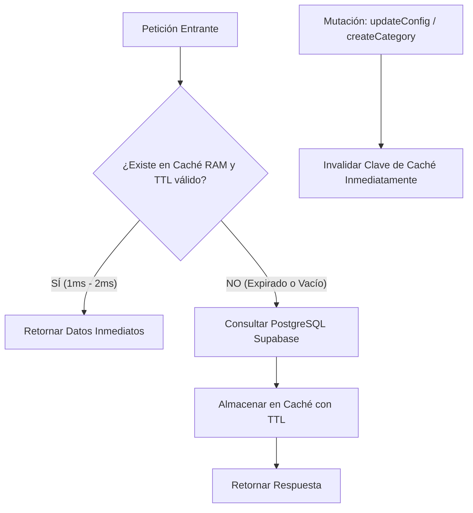

# Estrategia de Caché en Memoria (TTL In-Memory Caching)

## 1. El Problema de la Latencia Transcontinental

La base de datos PostgreSQL está alojada en **Supabase (Oregon, EE.UU.)**, mientras que el servidor y los clientes operan en Sudamérica. Cada viaje de ida y vuelta a la base de datos (RTT) toma aproximadamente **200ms a 300ms**.

Si una sola petición requiere 5 consultas secuenciales a PostgreSQL, la respuesta tarda más de **1.5 segundos**, provocando lentitud percibida en la tienda y en las respuestas de WhatsApp.

---

## 2. Solución: Capa de Caché en Memoria con Invalidación Reactiva

Se implementó una capa de almacenamiento en memoria RAM (In-Memory Map) con tiempo de vida (TTL) e invalidación inmediata ante escrituras:

---

## 3. Repositorios y Servicios Optimizados

1. **`PrismaCompanyConfigRepository` (TTL: 3 minutos):**
   - Caché por `tenantId`.
   - Utilizado en cada mensaje de WhatsApp de Luna, en el checkout público y en la carga de la tienda.
   - **Invalidación:** Se borra la entrada de caché al ejecutarse `updateConfig(...)`.

2. **`PrismaCategoryRepository` (TTL: 3 minutos):**
   - Caché para listados de categorías.
   - **Invalidación:** Se limpia automáticamente al crear, editar o borrar una categoría.

3. **`TenantsService.getPublicStore` (TTL: 45 segundos):**
   - Caché de la información pública consolidada de la tienda (datos del tenant, configuración visual y catálogo de productos activos).
   - **Resultados:**
     - Primera visita (Cache Miss): ~2,290 ms.
     - Siguientes visitas (Cache Hit): **1 ms - 2 ms** (~2,000x más rápido).
